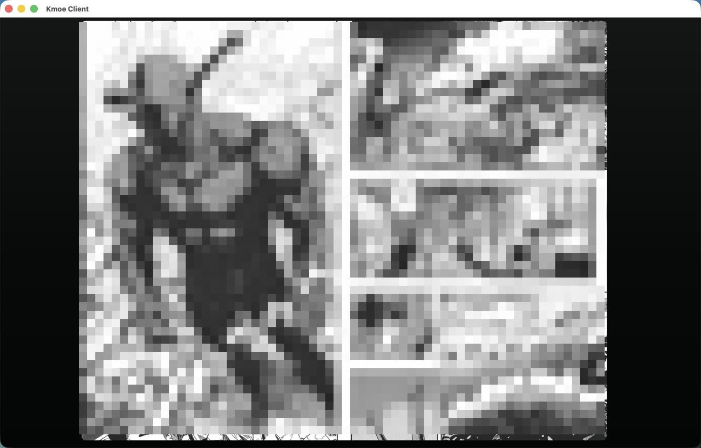

# Kmoe Client

Kmoe Client is an **Alpha / developer preview** unofficial KMOE online manga reader built with Tauri 2, React, TypeScript, Rust, and SQLite.

The project is meant to feel closer to a native app than a browser workflow: open the app, search or continue reading, open a title, and start reading without manually managing web tabs or downloaded files.

It focuses on users who do not want to keep manga files downloaded locally. Its product direction is lightweight online reading: open one title, read in high quality through temporary Reader cache, then clean up cache by policy so handheld devices such as iPhone and iPad do not lose large amounts of storage.

This project is not affiliated with, endorsed by, or representative of KMOE. Users are responsible for following the target site's terms of service, copyright law, and account-safety requirements. The project must not be used to bypass access controls, membership limits, quotas, anti-abuse mechanisms, or copyright restrictions.

Chinese documentation is canonical: [README.md](README.md).

## Preview

The screenshots below are redacted macOS developer-preview captures. Manga covers and pages are pixelated so the public repository can show the app structure without redistributing raw manga artwork.





## Status

This project is not stable software.

Developer-preview usable surfaces:

- iPhone: usable for personal testing and daily preview use; signed-device validation still needs more work.
- iPad: usable for personal testing and daily preview use; tablet layout and Reader are current priorities.
- macOS: usable as the main local development and preview platform.
- Windows: source and packaging paths exist, but real-machine install/open/reveal/signing validation is incomplete.

Future plan:

- Android phones and tablets: planned for low-storage online reading and temporary cache.
- Apple TV and Android TV: future research targets for remote-control input, landscape Reader, focus navigation, and cache policy.

## Features

- Live-first catalog, search, category, detail, account, and reading flows.
- Temporary Reader cache as the primary reading path, with explicit local download kept as an advanced/compatibility capability.
- Shelf, Continue Reading, reading history, reading progress, and settings.
- Reader modes for single page, spread, continuous flow, LTR/RTL, zoom, crop, rotation, chapter navigation, thumbnails, keyboard shortcuts, and touch gestures.
- Cover-aware visual theming derived from real cover pixels when available.

## Quick Start

```bash
corepack enable
corepack prepare pnpm@11.1.3 --activate
pnpm install
pnpm --dir apps/kmoe-app exec playwright install chromium
pnpm dev
```

Run the desktop app:

```bash
pnpm tauri dev
```

Common checks:

```bash
pnpm typecheck
pnpm test:run
pnpm build
pnpm check:platforms
```

See [docs](docs/README.md) for architecture, development, release, security, platform status, web-adapter, and Reader/Shelf notes.

## Release Status

This repository is prepared as source code. Public binary distribution still requires platform signing, notarization or installer QA, and signed physical-device validation where applicable. See [docs/status](docs/status/README.md).

## License

Kmoe Client is distributed under the [GNU General Public License v3.0](LICENSE).
