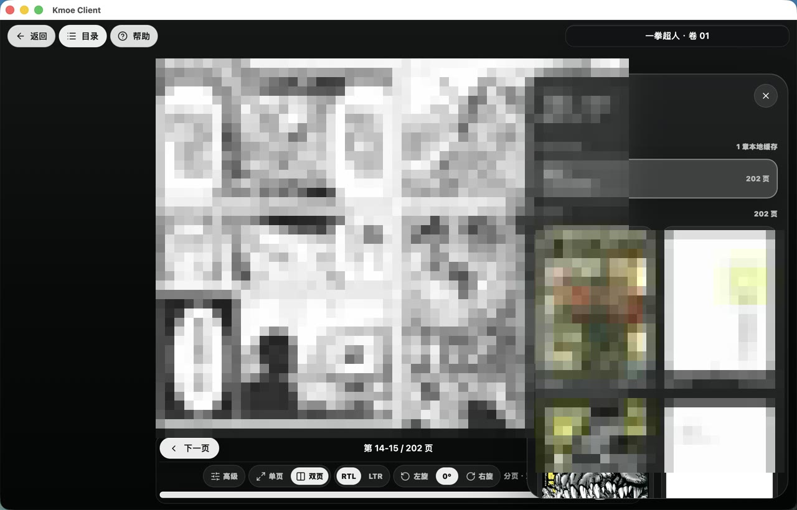
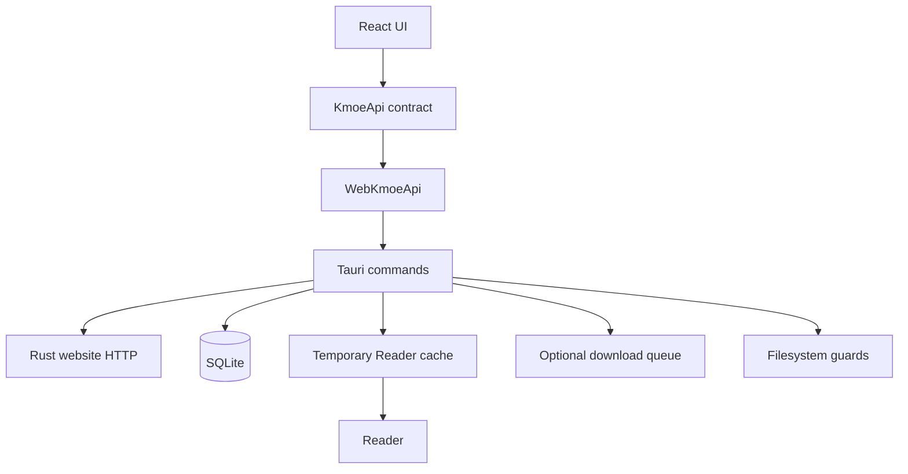

# kmoelite

kmoelite 是一个 **Alpha / 开发预览阶段** 的轻量非官方 KMOE 在线漫画阅读器，基于 Tauri 2、React、TypeScript、Rust 和 SQLite 构建。

目标是把常用的 KMOE 阅读流程做成一个更像原生 App 的入口：打开应用，搜索或进入书架，点开一本漫画，直接开始阅读。

本项目重点解决“不想长期下载漫画、只希望方便阅读”的需求：在 iPhone、iPad 等适合阅读漫画的手持设备上，存储容量价格很高，漫画资源又容易让本地存储快速膨胀。因此 kmoelite 的核心方向是**点开一本看一本，以临时 Reader cache 支撑高清阅读，并用前一章/当前章/后一章的滚动窗口自动清理旧缓存，尽量不占用宝贵的长期存储空间**。

本项目不隶属于 KMOE，不代表 KMOE 官方，也不提供任何规避站点限制、绕过会员权限、批量滥用下载或侵犯版权的能力。使用者需要自行遵守目标站点服务条款、版权法律和账号安全要求。

当前默认网站入口使用 `https://kxo.moe`。如果未来站点镜像或入口变化，需要同时更新前端配置、Rust Web Adapter、Tauri CSP、测试 fixture 和 live smoke 脚本。

English summary: [README.en.md](README.en.md)

## 预览

下面是 macOS 开发预览版的公开截图。为避免在开源仓库中直接传播真实漫画封面和页面内容，图片里的漫画画面已经做马赛克处理；截图重点展示 App 结构、详情页封面取色、Reader 和目录面板。




## 当前状态

kmoelite 仍处于 Alpha / 开发预览阶段，部分平台尚未完成完整测试，请不要将其视为稳定版本或正式发行版。

### 开发预览可用

| 平台 | 状态 |
| --- | --- |
| iPhone | 开发预览可用；iPhone simulator 已通过 packaged debug app 安装、启动、首屏渲染和 session restore smoke；iOS deep link 已注册并加固 pending route 交付，详情/Reader/下载、签名真机、文件导出/分享仍需继续补齐。 |
| iPad | 开发预览可用；iPad simulator 已通过 packaged debug app 安装、启动、平板布局、真实 EPUB 下载到 Reader、翻页和进度写入 smoke，签名真机、文件导出/分享和前后台行为仍需继续补齐。 |
| macOS | 开发预览可用；当前主要本地开发和日常试用平台，公开二进制发布仍需签名、公证和干净机器验证。 |
| Windows | 源码和打包路径存在；真机安装、卸载、open/reveal 和签名验证尚未完成。 |
| Android 手机 | 实验预览源码路径存在；Pixel 8 模拟器已通过真实登录、详情、EPUB 下载、Reader、翻页和本地阅读数据删除 smoke；系统分享桥源码、debug build 和 WebView bridge 注入 smoke 已通过，真机、真实文件分享 chooser 和签名发布仍未完整验证。 |
| Android 平板 | 实验预览源码路径存在；Pixel Tablet 模拟器已通过真实登录、详情、EPUB 下载、Reader、双页翻页和本地阅读数据删除 smoke；系统分享桥源码、debug build 和手机 WebView bridge 注入 smoke 已通过，真机、真实文件分享 chooser 和签名发布仍未完整验证。 |
| Android TV | 实验预览入口存在；Android TV 模拟器已通过真实登录、详情、EPUB 下载、Reader、遥控器翻页和本地阅读数据删除 smoke，系统分享桥源码、debug build 和手机 WebView bridge 注入 smoke 已通过；实体 TV、真实文件分享 chooser 和签名发布仍未完成。 |
| Apple TV | 后续研究方向；本机已安装 tvOS simulator runtime，可创建并启动 Apple TV 模拟器；tvOS SDK 不提供 WebKit，不能直接复用当前 Tauri/WKWebView 前端壳，后续需要 TVMLKit、TVUIKit 或原生 TV UI 方案。 |

当前状态和限制见 [docs/status](docs/status/README.md) 与 [docs/platforms](docs/platforms/README.md)。

## 最近更新

- 2026-06-18：修复 Android packaged app 运行中打开 `kmoelite://comic/<id>` 会触发 native intent 崩溃的问题；Pixel 8 模拟器已验证进程保持存活。
- 2026-06-18：移动端资料库和下载中心文件动作改为导出/分享语义；iPhone/iPad/Android 上不再显示桌面“查看位置”误导文案。
- 2026-06-18：移动端 Settings 保存位置改为只读 App 私有保存区说明，避免 iPhone/iPad/Android 上误以为可直接改外部下载目录。
- 2026-06-18：修复下载失败文案归因；站点额度/下载权限问题不再误显示为本地保存位置权限。
- 2026-06-18：iOS packaged build 注册并加固 `kmoelite://comic/<id>` 深链路；native pending route 会在前端启动后交给 React Router。

完整对外更新记录见 [CHANGELOG.md](CHANGELOG.md)；本地验证日志见 [TASK_PROGRESS.md](TASK_PROGRESS.md)；平台限制见 [docs/status](docs/status/README.md)。

### 更方便的使用方式

- iPhone / iPad：适合把它当作低存储占用的随身漫画阅读器，登录后从目录、搜索或书架进入详情页，点开章节直接阅读；Reader cache 默认只围绕前一章、当前章和后一章滚动保留，不作为长期收藏。
- Android 手机/平板：已有调试 APK 路径，手机和平板模拟器均已走通过真实登录、详情、EPUB 下载、Reader、翻页和本地阅读数据删除 smoke；当前仍不建议当作稳定日常版本。
- macOS：适合桌面阅读、调试和管理；可以像普通桌面 App 一样浏览、搜索、打开详情、继续阅读，也可以用 `pnpm tauri dev` 运行开发预览。
- 日常阅读流程：登录 -> 搜索或打开详情 -> 点开章节 -> Reader 自动记录进度 -> 自动预取后一章 -> 进入下一章时清理上上章等窗口外缓存。
- 普通阅读不要求用户主动打开网页，也不以下载为默认路径；需要长期保存时再使用显式下载、Library 或文件打开能力。
- iPhone / iPad 的显式下载会先保存在 App 内部保存区；需要放入“文件”App 或发到其他位置时，再使用导出/分享入口。

### 未来计划

- Apple TV：平台检查已经能暴露 tvOS 工具链状态，本机可启动 Apple TV 模拟器；tvOS SDK 不提供 WebKit，因此不能把现有 Tauri/WKWebView 壳直接搬到 Apple TV。后续需要单独设计 TVMLKit、TVUIKit 或原生 TV UI、遥控器输入、横屏 Reader、焦点导航和缓存策略，不承诺时间表。
- Android TV：已有实验启动、方向键焦点和 native remote 输入桥；Android TV 模拟器已跑通真实 EPUB 下载到 Reader、遥控器翻页和清理，下一步仍需实体 TV、签名发布和分发验证。

## 产品方向

- 原生 App 体验：把常用 KMOE 阅读流程收进一个桌面/移动客户端里，减少主动打开网页、切换页面和管理文件的成本。
- 在线阅读优先：打开一本读一本，不以长期保存漫画文件为默认路径。
- 临时缓存优先：Reader cache 用于流畅阅读和高清显示，不是收藏式下载库。
- 低存储占用：默认滚动保留前一章、当前章和后一章；继续阅读时清理窗口外 Reader cache。
- 高画质阅读：在合理网络与设备条件下尽量保持高分辨率漫画阅读体验。
- 多平台阅读：优先手持阅读设备，同时保留 Windows/macOS 桌面阅读体验。
- 显式下载保留为高级/兼容能力：当前代码仍有下载队列和 Library，但它们不是公开定位的主卖点。

## 功能概览

- 目录、搜索、分类、详情、账号状态等 live-first 页面。
- Reader 以临时 cache 打开章节，默认滚动保留前一章、当前章和后一章，支持继续阅读和阅读进度保存。
- Detail、Shelf、Library、Reader 和 Settings 提供显式“删除本地阅读数据”，用于释放 Reader cache 和对应 EPUB/源图 ZIP 本地阅读文件。
- 书架、继续阅读、阅读历史、阅读进度和设置。
- 单页、双页、连续阅读、LTR/RTL、缩放、裁切、旋转、章节导航、缩略图、键盘快捷键、触控手势和 iOS 状态栏显示设置。
- 详情页视觉主题从真实封面像素取色；固定色板只能作为失败兜底。
- 保留单任务顺序下载队列、Library 和文件打开能力，用于明确选择的本地保存或兼容场景。

## 截图策略

仓库可以保留两类图片：

- 可复现的 Playwright visual baseline：`apps/kmoe-app/e2e/visual.spec.ts-snapshots/`。
- 公开文档使用的脱敏宣传图：`docs/assets/screenshots/`。

不要提交临时手动截图、未打码真实漫画图片、封面缓存、下载文件、runtime cache、账号状态、Cookie、Token、Session 或本机私有路径。若发现 visual snapshot 或宣传图含真实版权素材，应替换为合成 fixture、马赛克版本或移除。

## 快速开始

环境要求：

- Node.js，版本需兼容已提交的 pnpm lockfile。
- 通过 Corepack 使用 pnpm。
- Rust stable toolchain。
- 当前平台对应的 Tauri 系统依赖。

```bash
corepack enable
corepack prepare pnpm@11.1.3 --activate
pnpm install
pnpm --dir apps/kmoe-app exec playwright install chromium
pnpm dev
```

运行 Tauri 桌面应用：

```bash
pnpm tauri dev
```

构建 Web 资源：

```bash
pnpm build
```

本地 macOS debug app 构建：

```bash
pnpm tauri:build:mac-app:debug
```

iPhone / iPad simulator 开发预览构建示例见 [docs/platforms](docs/platforms/README.md)。

Android debug APK/AAB 构建需要本机 Android SDK/NDK：

```bash
pnpm tauri:android:build:debug
```

## 常用命令

```bash
pnpm dev                       # Vite 浏览器开发
pnpm tauri dev                 # Tauri 桌面开发
pnpm typecheck                 # TypeScript 类型检查
pnpm test:run                  # Vitest
pnpm build                     # 生产 Web 构建
pnpm e2e                       # Playwright
pnpm check:platforms           # 平台自检
pnpm check:ios-assets          # iOS 图标/资源自检
pnpm tauri:android:build:debug # Android debug APK/AAB
pnpm verify:release            # 本地 release gate
```

Rust 检查：

```bash
cargo fmt --all --manifest-path apps/kmoe-app/src-tauri/Cargo.toml -- --check
cargo check --manifest-path apps/kmoe-app/src-tauri/Cargo.toml
cargo test --manifest-path apps/kmoe-app/src-tauri/Cargo.toml
```

真实站点 smoke 和真实下载验证默认关闭，只能通过显式 runtime 环境变量执行。详见 [docs/development](docs/development/README.md) 和 [docs/security](docs/security/README.md)。

## 架构



目录地图：

- `apps/kmoe-app/src/`：React 页面、路由、store、parser、Reader UI 和样式。
- `apps/kmoe-app/src-tauri/src/`：Tauri commands、Rust HTTP、SQLite、文件系统、临时 Reader cache 和可选下载能力。
- `apps/kmoe-app/src/tests/`：Vitest 测试和 fixtures。
- `apps/kmoe-app/e2e/`：Playwright 测试和 visual snapshots。
- `scripts/`：发布检查、平台检查、iOS 资源检查和显式 live verification 脚本。
- `docs/`：架构、开发、发布、安全、平台、状态、Web adapter、Reader/Shelf 文档。

## 贡献

请先阅读 [CONTRIBUTING.md](CONTRIBUTING.md)。贡献应优先服务轻量在线阅读、临时缓存、低存储占用和高清 Reader 体验；不要添加用户可见 mock/demo 模式，不提交凭证或下载文件，并在行为变化时补充测试和文档。

## 安全

不要提交账号、密码、Cookie、Session、Token、授权 URL、runtime 数据库、本地下载文件、构建产物或本机私有路径。安全问题处理方式见 [SECURITY.md](SECURITY.md)。

## 许可证

kmoelite 以 [GNU General Public License v3.0](LICENSE) 发布。
