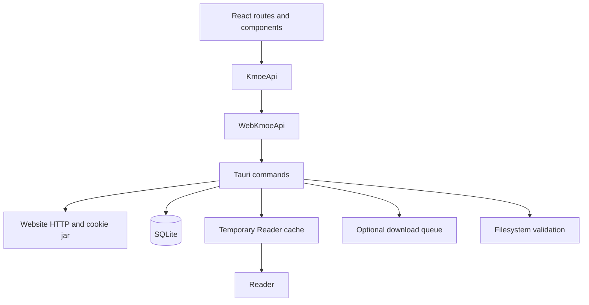

# 架构

Kmoe Client 是 Tauri 2 应用：React/TypeScript 负责用户界面和前端状态，Rust 负责网站 HTTP、SQLite、文件系统、临时 Reader cache、可选下载执行和缓存清理。

项目的默认产品方向是在线阅读优先。Reader cache 是为了高清阅读、快速翻页和短期恢复而存在的临时缓存，不是默认长期下载库。

## Runtime 边界

Production runtime 不提供用户可见 mock/demo 模式。Browser development 可以渲染 UI 并运行 fixture-backed tests，但真实网站、临时缓存、本地文件和显式下载行为必须走 Tauri native commands。

## 前端

- `apps/kmoe-app/src/App.tsx`：路由和全局 providers。
- `apps/kmoe-app/src/layouts/AppLayout.tsx`：桌面、平板、手机 shell。
- `apps/kmoe-app/src/pages/`：页面级产品界面。
- `apps/kmoe-app/src/store/`：settings、downloads、Shelf、cache、reading state。
- `apps/kmoe-app/src/reading/`：Reader 入口、archive source、cache policy、prefetch helpers。
- `apps/kmoe-app/src/parsers/`：HTML/JavaScript response parser。
- `apps/kmoe-app/src/platform/`：typed native command bridge。

## 原生核心

- `commands.rs`：WebView 可调用的 command boundary。
- `db.rs`：SQLite schema 和 persistence helpers。
- `web_adapter.rs`：真实站点请求、解析和 session orchestration。
- `downloader.rs` / `queue.rs`：显式单任务下载和队列状态。
- `reader.rs`：archive inspection、页面提取、cache limits。
- `fs_utils.rs`：路径规范化、文件名安全、trusted root checks。

Native commands 必须返回 typed failures。SQLite、filesystem、website 错误不能伪装成空成功快照，否则会覆盖真实前端状态。

## 数据模型分离

以下概念必须分离：

- 网站目录/详情 metadata。
- 书架 membership。
- temporary Reader cache rows 和 extracted pages。
- reading progress 和 reading history。
- permanent downloaded files。
- local Library records。
- optional download tasks。
- app settings。

临时 Reader cache 可以按策略清理；清理缓存不能删除永久下载、书架记录、阅读历史或队列记录。永久下载和 Library records 必须代表明确用户意图，不应成为普通在线阅读的默认路径。

## 存储策略

- 普通阅读优先准备临时 Reader cache。
- 阅读结束、章节切换、策略窗口外、存储压力达到阈值时，应优先清理旧缓存。
- Space-saver 策略应减少预取和保留窗口。
- 显式下载、永久文件和显示位置功能保留为高级/兼容能力。

## 测试边界

Vitest fixture 位于 `apps/kmoe-app/src/tests/fixtures/`。Playwright fixture 位于 `apps/kmoe-app/e2e/fixtures/`。它们不是生产 runtime 模式，不能被正常用户路径导入。
